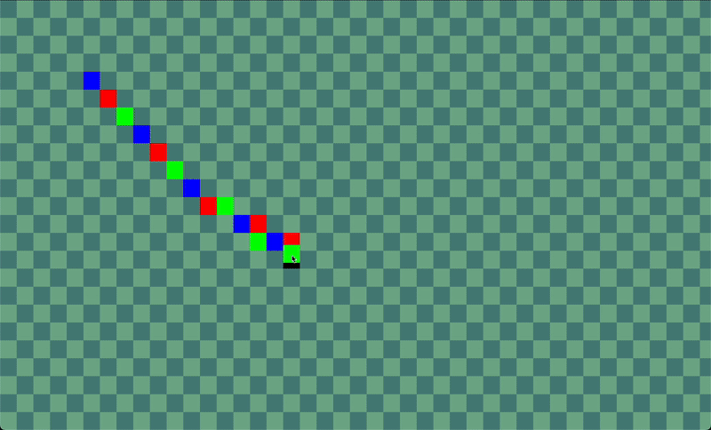

# GGL | GenesisGL


[](https://choosealicense.com/licenses/mit/)

GGL (GenesisGL) is an easy-to-use 2D graphics library written in C using OpenGL and GLFW.  
Perfect for creating lightweight 2D games and graphical interfaces without headaches. 🚀

---

## Examples


## Dependencies  
Make sure you have these installed to use GGL:

- [OpenGL](https://www.opengl.org/) – the core graphics library  
- [GLFW](https://www.glfw.org/) – for window and input management  
- A compatible C compiler (gcc, clang, etc.)

---

## Build

To build the library on Linux, MacOS, or Windows, simply run:

```bash
./build.sh
```

## Usage

Include GGL in your project, compile, and use its simple functions to draw shapes, manage windows, and handle events.

To compile a test example, run:
```bash
cd ./samples/test_game && ./build.sh
```
Or just check the samples/ folder for practical use cases.

## Documentation (W.I.P.)

Documentation is coming soon, stay tuned! 📚

## Authors

- [@matteoepitech](https://www.github.com/matteoepitech)
